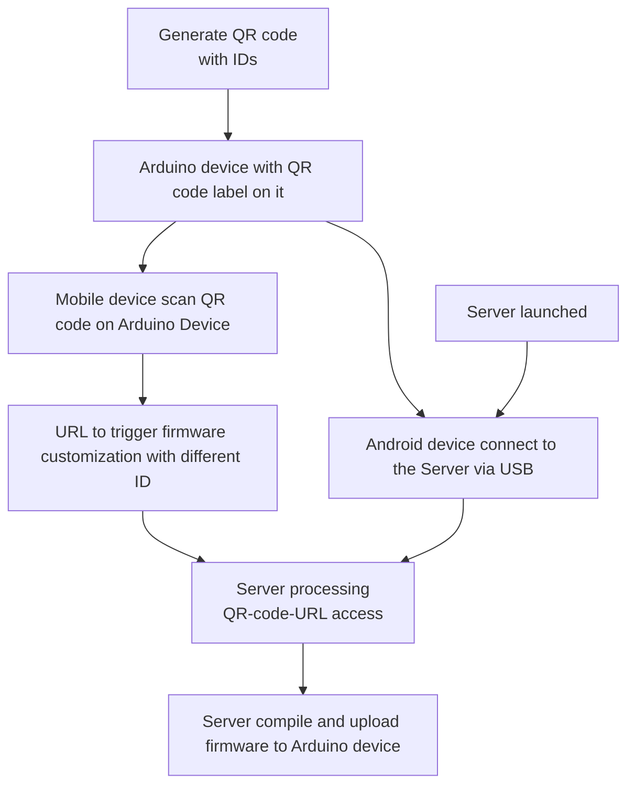

# Raspberry Pi flashing customized Arduino sketch to the module
With the nodeJS program running on Raspberry Pi (or PC),  the firmware of the Arduino modules can be 
1. customized  
2. compiled 
3. and then uploaded 
to the module with Raspberry Pi (or PC) via USB port. 

The use case is like: 




Note: 
* The source code files in this repo are just sample code. Please read this document and make necessary modification.
* The arduino sketch files are from https://github.com/StuartsProjects/SX12XX-LoRa by adding the macro define of `LORA_NET_ID` in order to explain how a variable is chnaged by the script outside. 
* Only tested on RPi 4 and macos. 
 

## Step 1 : Set up the environment
The arduino firmware is from https://github.com/StuartsProjects/SX12XX-LoRa. It can be compiled and then uploaded to the module with Raspberry Pi (or PC) running `arduino-cli` . 

`arduino-cli` can be installed via Homebrew or Sanp Store. Here we are using Homebrew. 

ref: 
* https://arduino.github.io/arduino-cli/0.21/installation/
* https://snapcraft.io/install/arduino-cli/raspbian

### Install Homebrew on Linux 

Login Raspberry Pi and use the followig command to install Homebrew on Linux. 

```bash
    /bin/bash -c "$(curl -fsSL https://raw.githubusercontent.com/Homebrew/install/HEAD/install.sh)"
```

Remember to run the following cooamd after the installation is done

```bash
    echo >> /home/pi/.bashrc
    echo 'eval "$(/home/linuxbrew/.linuxbrew/bin/brew shellenv)"' >> /home/pi/.bashrc
    eval "$(/home/linuxbrew/.linuxbrew/bin/brew shellenv)"
```

Then verify the installation with the following command 

```bash
    brew version
```

ref: https://github.com/Homebrew/install

### Install arduino-cli
Install `arduino-cli` with the following command on Raspberry Pi

```bash
    brew update
    brew install --build-from-source arduino-cli
```

Verify the installation with the following command 

```bash
    arduino-cli version
```

### Install nvm

Install `nvm` by taking reference from https://github.com/nvm-sh/nvm?tab=readme-ov-file#installing-and-updating
Usually, the following comamnd works

```bash
    curl -o- https://raw.githubusercontent.com/nvm-sh/nvm/v0.40.3/install.sh | bash
```

Remember to run the following command adter the installation 

```bash
    export NVM_DIR="$HOME/.nvm"
    [ -s "$NVM_DIR/nvm.sh" ] && \. "$NVM_DIR/nvm.sh"  # This loads nvm
    [ -s "$NVM_DIR/bash_completion" ] && \. "$NVM_DIR/bash_completion"  # This loads nvm bash_completion
```

Verify the installation:

```bash 
nvm --version
```

### Install NodeJS with nvm

```bash
    nvm install v22.15.1
```
Verify the installation:

```bash 
node --version
```


### Copy the source code to Raspberry pi

Copy the the folder of this repo to Raspberry Pi's home folder, `/home/pi/`


### Install the board package and libraries of arduino-cli 
Assuming the source code folder is copied to raspberry pi as  `/home/pi/rpi-arduino/`

```bash 
    cd /home/pi/rpi-arduino/
    arduino-cli core update-index --config-file ./arduino/arduino-cli.yaml
    arduino-cli config set library.enable_unsafe_install true
    arduino-cli core install arduino:avr
    arduino-cli core install esp32:esp32
    arduino-cli board listall
    arduino-cli lib install --git-url https://github.com/StuartsProjects/SX12XX-LoRa.git
    arduino-cli lib install --git-url https://github.com/Seeed-Studio/Grove_BME280.git
    arduino-cli lib install Low-Power
    arduino-cli lib install u8g2
```


* Note 1 
  * `arduino-cli core install esp32:esp3` might be failed because of remote-timeout. Try again if you see any error message on the screen after running `arduino-cli core install esp32:esp3`
  * The error message mentioned above is like

```
esp32:esp-rv32@2411 context deadline exceeded (Client.Timeout or context cancellation while reading body)
Error during install: context deadline exceeded (Client.Timeout or context cancellation while reading body)
```

* Note 2
If you are running `arduino-cli config set library.enable_unsafe_install true` on macos and got the following error message: 

```
arduino-cli config set library.enable_unsafe_install true
Writing config file: Config File "arduino-cli" Not Found in "[/Users/clementyu/Library/Arduino15]"
```

Try the following command to eliminate this error. 

```bash
 touch ~/Library/Arduino15/arduino-cli.yaml
``` 

### Install NodeJS modules

```bash
    cd /home/pi/test/server/
    npm i
```

## Step 2 : Connect the Arduino Module and fix its port access. 

* Check the follwoing pages to Fix the Arduino Module's UART port on Linux. 

- https://forums.raspberrypi.com/viewtopic.php?t=317202
- https://support.arduino.cc/hc/en-us/articles/360016495679-Fix-port-access-on-Linux

In the sample code of `upgrade-firmware.sh`  it is assumed that the UART port is fixed to `/dev/ttyACM0` 

* Connect the arduino module to the PC or raspberry pi. 

## Step 3 : Launch the server 

* Launch the server with the following command

```bash 
    node ./server/qr-api-server.js
```

If the IP address is not changed, the server is running at http://localhost:3000


## Step 3 : Trigger the firmware customization and installation by QR Code

* Create QR code with URL like `http://127.0.0.1:3000/trigger/?data=0x10`
  * Change IP address to the host where the server launched. 
  * `data=0x10` sets the node(arduino module) ID to `0x10` , the node ID is from 0x00 to 0xFF  
  * This node ID is based on the addressing mechanism in the sample code. Refer to https://github.com/StuartsProjects/SX12XX-LoRa/blob/master/ReadMe.md#packet-addressing for more details. 

* Use any QR code online tool to generate the QR code of the URL, `http://127.0.0.1:3000/trigger/?data=0x10`. 

* Scan the QR code with device that can access the IP address of the URL `http://127.0.0.1:3000/trigger/?data=0x10` 
  * Note: `127.0.0.1` is just the local address of the host. Change it to the domain or IP address that your mobile device can access. 
  
* Then the firmware of the arduino module (ndk_node or farm_hub_node) will be updated and flashed into the device. 
